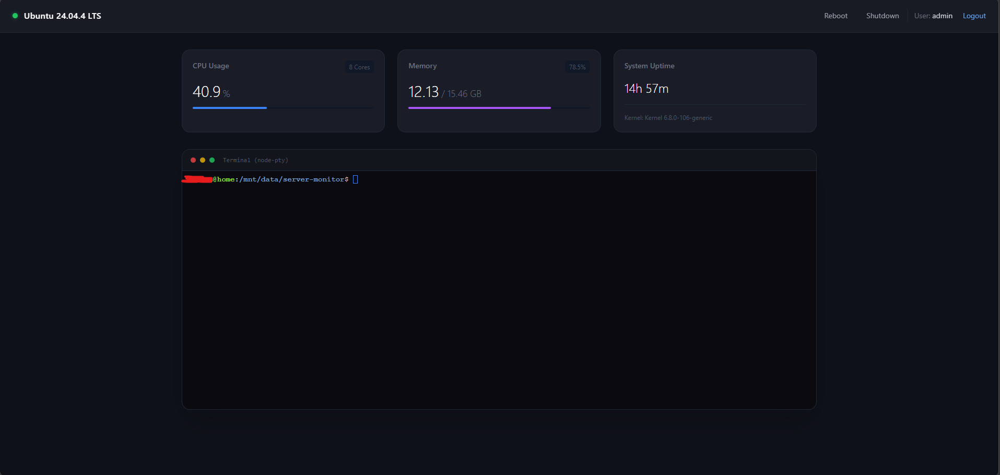

# 🐧 Minimalist Ubuntu Server Dashboard

A lightweight, high-performance web-based server management dashboard built specifically for Linux/Ubuntu servers. Powered by **Bun** and **Elysia.js**, this tool provides real-time system monitoring, an interactive web terminal, and power management capabilities right from your browser.



## ✨ Features

- 📊 **Real-time System Metrics:** Monitor CPU load, Memory usage, and System Uptime instantly.
- 💻 **Interactive Web Terminal:** A fully functional, bidirectional pseudo-terminal (PTY) running natively on Linux.
- 🔐 **Secure Authentication:** Built-in login system utilizing JSON Web Tokens (JWT) stored in HTTP-only cookies to prevent XSS attacks.
- ⚡ **Power Management:** Safely reboot or shutdown your server directly from the UI.
- 🎨 **Minimalist UI:** Clean and responsive interface styled with Tailwind CSS.
- 🚀 **Blazing Fast:** Built on top of Bun runtime for maximum performance and minimal memory footprint.

## 🛠️ Tech Stack

- **Backend:** [Bun](https://bun.sh/) + [Elysia.js](https://elysiajs.com/)
- **Frontend:** HTML5, [Tailwind CSS](https://tailwindcss.com/) (SSR)
- **System Info:** `systeminformation`
- **Terminal:** Native Linux `script` via `child_process` + WebSockets

## 📦 Prerequisites

Before installing, make sure you have the following installed on your Ubuntu server:
- Linux OS (Ubuntu recommended)
- [Bun](https://bun.sh/) (v1.0 or higher)
- Root/Sudo privileges (for power management commands)

## 🚀 Installation & Quick Start

**1. Clone the repository**
```bash
git clone https://github.com/SilSea/server-monitor.git
cd server-monitor
```

**2. Install dependencies**
```bash
bun install
```

**3. Configure Environment Variables**
Create a `.env` file in the root directory and set your credentials:
```env
ADMIN_USER=your_username
ADMIN_PASS=your_secure_password
JWT_SECRET=your_super_secret_jwt_key
```

**4. Configure Sudoers (Optional but recommended for Power Management)**
To allow the dashboard to reboot/shutdown without prompting for a password in the terminal, run `sudo visudo` and add:
```text
your_username ALL=(root) NOPASSWD: /sbin/reboot, /sbin/shutdown
```

**5. Run the server**
```bash
bun run src/index.ts
```
The dashboard will be available at `http://localhost:3000`

## ⚠️ Security Warning
Exposing a web-based terminal to the public internet can be extremely dangerous. It is highly recommended to:
1. Run this dashboard behind a **Reverse Proxy** (like Nginx or Cloudflare Tunnel).
2. Enable **HTTPS / SSL**.
3. Use a strong password in your `.env` file.
4. Restrict access via firewall (e.g., UFW) to trusted IP addresses only.

## 📄 License
This project is licensed under the MIT License.